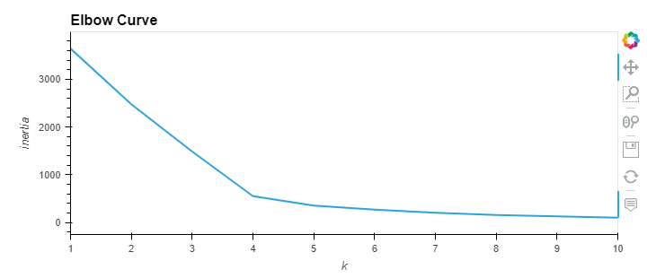
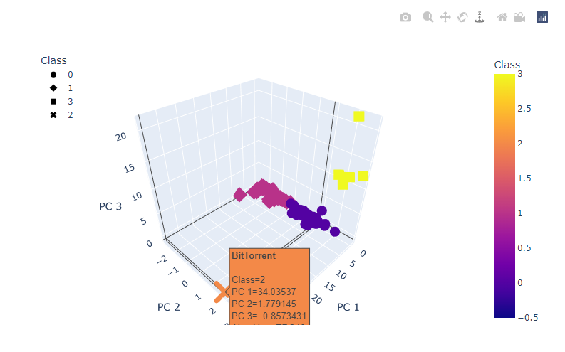
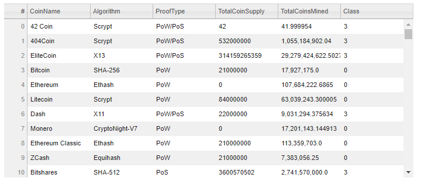
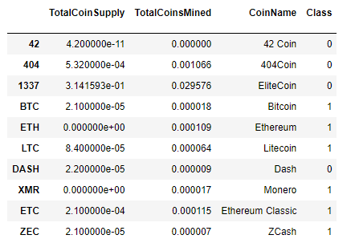
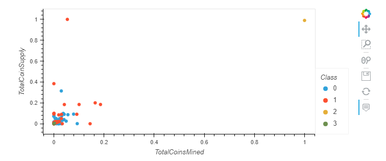

# Cryptocurrencies

## Overview
Using a clustering algorthim, data visualizations will be used to create a report that includes what cryptocurrencies are on the trading market and how they could be grouped to create a classification system for a new investment.

### Steps Involved
1. Preprocessing data for PCA
2. Reducing data dimensions using PCA
3. Clustering Cryptocurrencies using K-means
4. Visualizing Cryptocurrencies results

## Results

### Clustering Cryptocurrency Data using K-Means

#### Elbow Curve Results

### Visuals Created for Cryptocurrency Analysis

#### 3D Scatter Plot with Clusters

#### HV Plot Table

#### Scatter Plot with Clusters
A DataFrame, named `plot_df`, was created with the `clustered_df` information and the `CoinName` and `Class` columns were added as well.

A scatter plot was created from the `plot_df` DataFrame.

